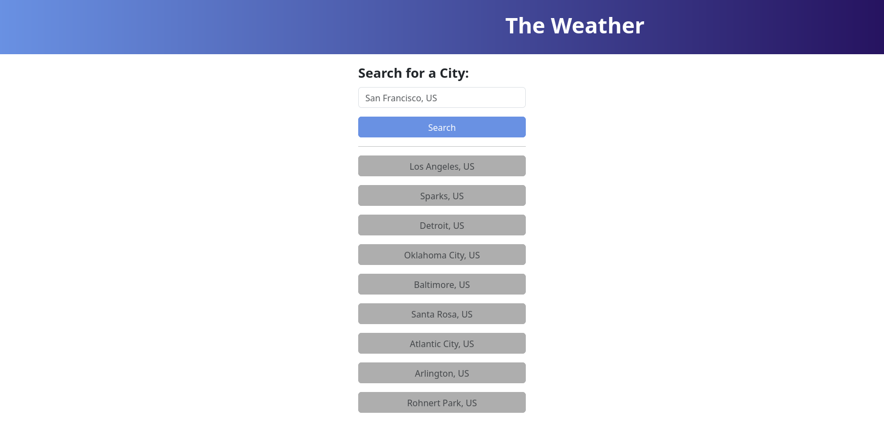
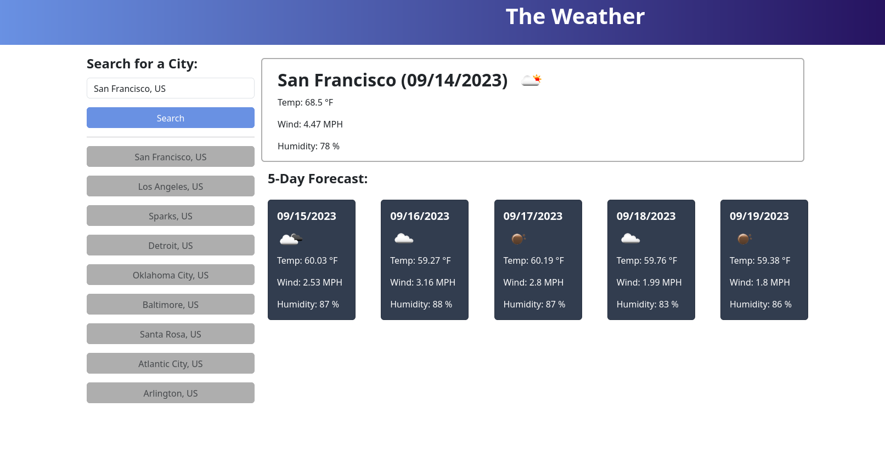
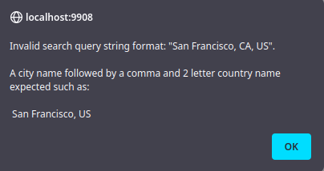
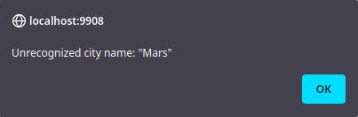
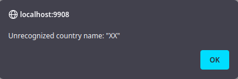
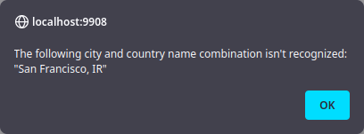

# The Weather

Weather app to look up the weather conditions by city.

## Use

A city name and country delineated by a comma, for instance `San Francisco, US`, is used to get the current and 5 day
weather forecast for that city. If the city or country name isn't recognized or the inputted format isn't correct, then
an alert is displayed highlighting the problem.

Up to 20 searches are saved in the history and can easily be recalled.

### Init view

Upon initializing the web app, the user is prompted with the option to search for a city or recall a previously searched
city (if there is any stored search history):

### Weather search result

After putting in a valid city or selecting one from the search history, the current weather and midday 5 day weather
forecast for that city is displayed:

### Invalid search query

If an invalid city search query is inputted, an alert message is displayed to the user highlighting what the problem is.
There are 4 different types of reasons input might be invalid:

1. The input isn't formatted incorrectly. A city name followed by a comma followed by a 2 letter country name is
   expected. If input doesn't follow this format, the following alert is displayed:

   

1. The input contains a city name that isn't recognized:

   

1. The input contains a country name that isn't recognized:

   

1. The input contains a city and country name combination that isn't recognized:

   

1. Empty/blank input is also invalid, however this doesn't cause an alert box to appear.
